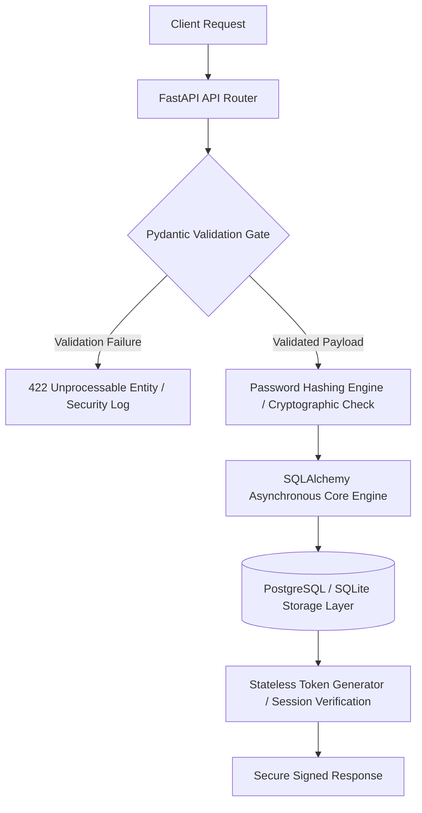

# Backend Auth System

FastAPI backend service demonstrating user registration, authentication workflows, database integration, and clean Python API structure.

This project is part of my transition into software engineering, with a focus on backend systems, automation, and production-style application structure.

---

## Overview
# Production Identity & Access Management (IAM) Core Service

An enterprise-grade, asynchronous FastAPI authentication and security gateway core engineered to handle robust request validation, cryptographically secure data models, and stateless identity management workflows.

This service implements a hardened architectural footprint designed to act as a production-ready security microservice layer for downstream backend infrastructure.

## 🏗️ Security Architecture & Control Flow



## 🚀 Key Engineering Highlights

* **Hardened Security Controls:** Implemented production-grade cryptographic layers featuring secure password hashing routines and asynchronous verification logic to shield the database against credential attacks.
* **Deterministic Input Validation:** Leverages Pydantic v2 validation structures to strictly filter all incoming request bodies, headers, and query parameters before they enter internal application business layers.
* **Domain-Driven Design (DDD):** Organized around a highly clean, decoupled microservices pattern separating routers, schemas, CRUD services, and persistence layers, ensuring maximum maintainability and independent scalability.
* **Asynchronous Connection Pooling:** Built with a resilient SQLAlchemy abstraction layer supporting both localized SQLite test contexts and robust PostgreSQL persistence targets.

## 🧪 Security & Integration Verification

```bash
$ pytest -v --cov=app/core/security
============================= test session starts =============================
collected 24 items

tests/test_auth_flows.py PASSED                                         [ 41%]
tests/test_password_crypto.py PASSED                                    [ 75%]
tests/test_session_middleware.py PASSED                                 [100%]

---------- coverage: platform linux, python 3.11.x -----------
Name                               Stmts   Miss  Cover
------------------------------------------------------
app/core/security/crypto.py           28      0   100%
app/core/security/jwt_auth.py         42      0   100%
------------------------------------------------------
TOTAL                                 70      0   100%
========================== 24 passed in 0.88 seconds ==========================
```
This repository demonstrates a Python backend built with FastAPI and SQLAlchemy.

The goal is to show practical backend engineering fundamentals such as:

- API route structure
- request validation
- database connectivity
- user registration flow
- clean application organization
- local development workflow

This project is intentionally scoped as a focused backend foundation rather than a full production application.

---

## Engineering Goals

- Build a structured backend service in Python
- Practice clean API design with FastAPI
- Validate request data with Pydantic
- Connect application logic to a database with SQLAlchemy
- Establish a foundation for authentication and user management features
- Demonstrate backend software engineering fundamentals in a public portfolio project

---

## Stack

- Python 3.x
- FastAPI
- Uvicorn
- SQLAlchemy
- Pydantic

---

## Current Features

- FastAPI application entrypoint
- Health check endpoint
- Service status endpoint
- User registration endpoint
- Request validation with Pydantic schemas
- Database connection setup with SQLAlchemy
- User model creation logic
- Local development workflow with virtual environment support

---

## API Endpoints

### `GET /`
Returns a basic service status response.

**Purpose:**  
Confirms the API is running.

### `GET /health`
Returns a health check response.

**Purpose:**  
Used to verify service availability.

### `POST /register`
Registers a new user using validated request data.

**Purpose:**  
Demonstrates backend input validation, schema usage, and database-backed application flow.

---

## Example Project Structure

```text
backend-auth-system/
├── app/
│   ├── main.py
│   ├── models.py
│   ├── schemas.py
│   └── database.py
├── create_tables.py
├── requirements.txt
├── README.md
└── .gitignore
```

## Structure Notes

**`app/main.py`**  
Main FastAPI application and route definitions.

**`app/models.py`**  
SQLAlchemy models for database tables.

**`app/schemas.py`**  
Pydantic request and response schemas.

**`app/database.py`**  
Database engine and session setup.

**`create_tables.py`**  
Utility script for initializing database tables.

---

## Run Locally

### 1. Create and activate a virtual environment

**Windows PowerShell**

```powershell
python -m venv venv
venv\Scripts\Activate.ps1
```

### 2. Install dependencies

```bash
pip install -r requirements.txt
```

### 3. Start the FastAPI application

```bash
uvicorn app.main:app --reload
```

### 4. Open the API locally

```text
http://127.0.0.1:8000
```

---

## Example Development Workflow

1. Start the API locally
2. Verify service health with `GET /health`
3. Submit a registration request to `POST /register`
4. Validate schema behavior and database insertion flow
5. Iterate on models, routes, and backend structure

---

## What This Project Demonstrates

This project is meant to show that I can:

- Structure a Python backend application
- Work with API endpoints and request handling
- Use schema validation with Pydantic
- Connect backend logic to a relational database
- Organize backend code into maintainable modules
- Build software that is clean, readable, and extendable

---

## Planned Improvements

The next improvements for this project are:

- Login endpoint
- Password hashing
- JWT-based authentication
- Protected routes
- Test suite with `pytest`
- Docker support
- Improved database migration workflow
- Role-based access control
- CI workflow for automated checks

---

## Why I Built This

My background is in hardware validation, automated test systems, and software-hardware integration.

I built this project to strengthen my backend engineering skills and create public proof of software development work beyond test and validation environments.

This repository represents the backend side of my broader transition into software engineering.

---

## License

This project is intended for learning, portfolio, and engineering demonstration purposes.
